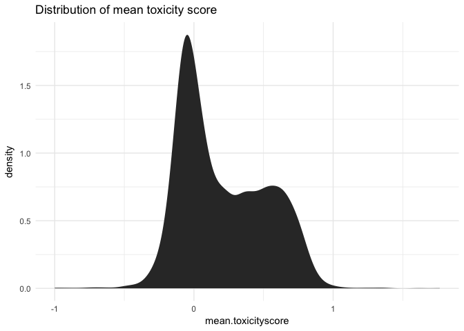
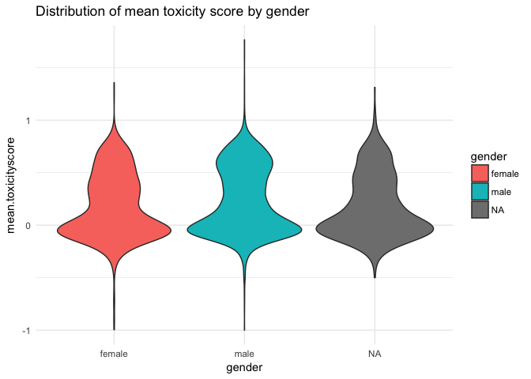
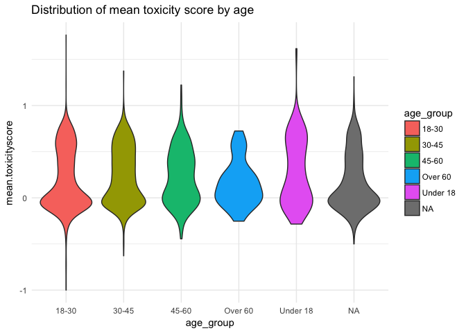
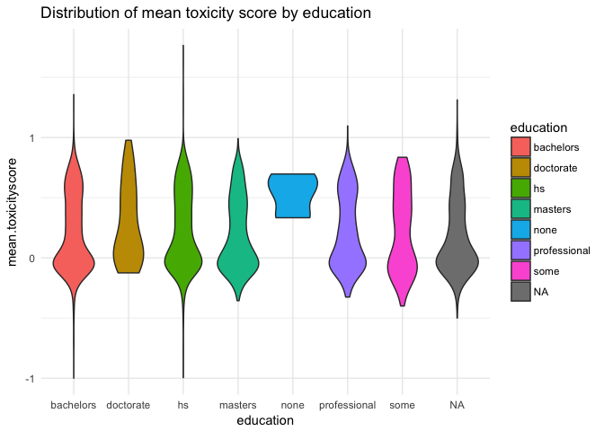
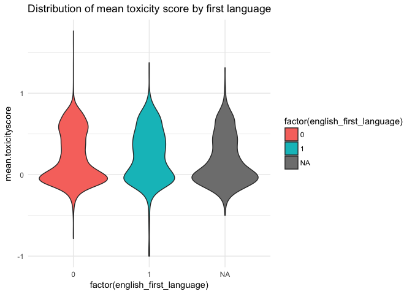
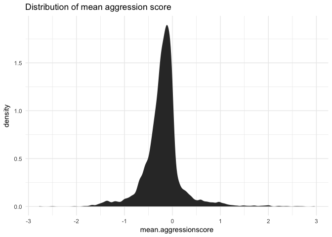
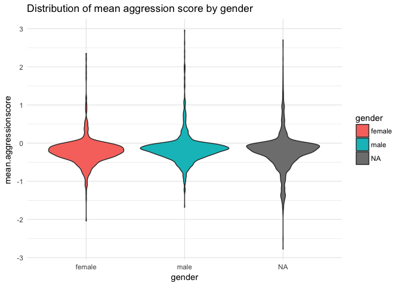
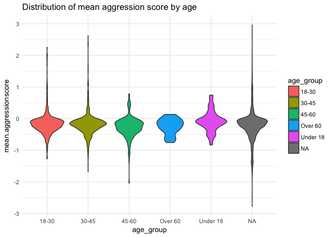
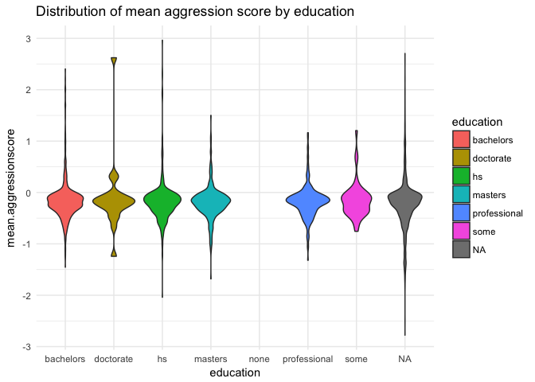
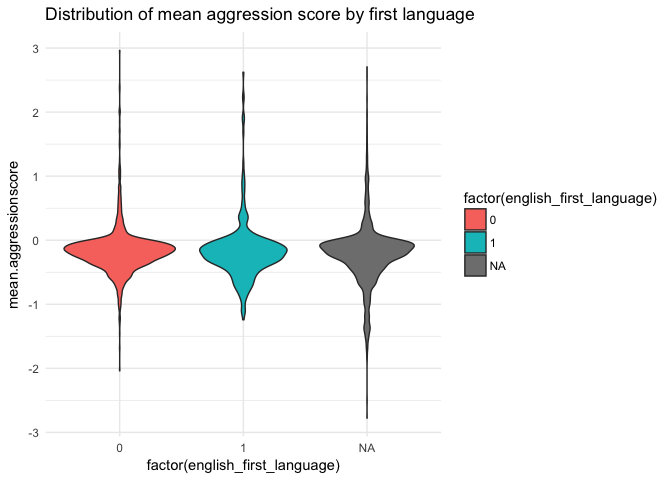

Automated content moderation code
================

-   [Toxicity](#toxicity)
-   [Distribution of average toxicity per worker.](#distribution-of-average-toxicity-per-worker.)
-   [Getting aggressive](#getting-aggressive)
-   [Distribution of average aggression per worker.](#distribution-of-average-aggression-per-worker.)

Import a load of stuff

``` r
require(irr)
require(boot)
require(tidyverse)
require(pander)
```

Toxicity
--------

``` r
tox <- read_tsv("dat/toxicity_annotated_comments.tsv")
tox.dem <- read_tsv("dat/toxicity_worker_demographics.tsv")
tox.ann <- read_tsv("dat/toxicity_annotations.tsv")
agg <- read_tsv("dat/aggression_annotated_comments.tsv")
agg.dem <- read_tsv("dat/aggression_worker_demographics.tsv")
agg.ann <- read_tsv("dat/aggression_annotations.tsv")
```

``` r
# Join data frames together
tox.ann %>% left_join(tox.dem) -> tox.long
```

    ## Joining, by = "worker_id"

Distribution of average toxicity per worker.
--------------------------------------------

We might want to know what the average worker's toxicity score is.

``` r
tox.long %>% group_by(worker_id, gender, age_group, education, english_first_language) %>% filter(gender %in% c("male", "female", NA)) %>% summarise(mean.toxicityscore = mean(toxicity_score)) -> tox.workermeans


ggplot(tox.workermeans) + stat_density(aes(mean.toxicityscore)) + ggtitle("Distribution of mean toxicity score") + theme_minimal()
```



``` r
ggplot(tox.workermeans) + 
  geom_violin(aes(y = mean.toxicityscore, 
                  fill = gender, 
                  x = gender)) + 
  ggtitle("Distribution of mean toxicity score by gender") + 
  theme_minimal()
```



``` r
ggplot(tox.workermeans) + 
  geom_violin(aes(mean.toxicityscore, 
                  fill = age_group, 
                  x = age_group)) + 
  ggtitle("Distribution of mean toxicity score by age") + 
  theme_minimal()
```



``` r
ggplot(tox.workermeans) + 
  geom_violin(aes(mean.toxicityscore, 
                  fill = education, 
                  x = education)) + 
  ggtitle("Distribution of mean toxicity score by education") + 
  theme_minimal()
```



``` r
  ggplot(tox.workermeans) + 
  geom_violin(aes(mean.toxicityscore, 
                  fill = factor(english_first_language), 
                  x = factor(english_first_language))) + 
  ggtitle("Distribution of mean toxicity score by first language") + 
  theme_minimal()
```



### Can we predict who will have a higher mean toxicity score?

Do this over the data with NA's subsetted out.

``` r
lm(formula = mean.toxicityscore ~ gender + age_group + education + english_first_language,
   data = tox.workermeans %>% na.omit) %>% 
  summary %>% 
  pander(add.significance.stars = T)
```

<table>
<colgroup>
<col width="36%" />
<col width="13%" />
<col width="16%" />
<col width="12%" />
<col width="13%" />
<col width="6%" />
</colgroup>
<thead>
<tr class="header">
<th align="center"> </th>
<th align="center">Estimate</th>
<th align="center">Std. Error</th>
<th align="center">t value</th>
<th align="center">Pr(&gt;|t|)</th>
<th></th>
</tr>
</thead>
<tbody>
<tr class="odd">
<td align="center"><strong>gendermale</strong></td>
<td align="center">0.05509</td>
<td align="center">0.01117</td>
<td align="center">4.932</td>
<td align="center">8.522e-07</td>
<td>* * *</td>
</tr>
<tr class="even">
<td align="center"><strong>age_group30-45</strong></td>
<td align="center">0.05009</td>
<td align="center">0.01156</td>
<td align="center">4.334</td>
<td align="center">1.508e-05</td>
<td>* * *</td>
</tr>
<tr class="odd">
<td align="center"><strong>age_group45-60</strong></td>
<td align="center">0.04463</td>
<td align="center">0.01972</td>
<td align="center">2.263</td>
<td align="center">0.02369</td>
<td>*</td>
</tr>
<tr class="even">
<td align="center"><strong>age_groupOver 60</strong></td>
<td align="center">-0.01468</td>
<td align="center">0.05782</td>
<td align="center">-0.2538</td>
<td align="center">0.7996</td>
<td></td>
</tr>
<tr class="odd">
<td align="center"><strong>age_groupUnder 18</strong></td>
<td align="center">0.06791</td>
<td align="center">0.03663</td>
<td align="center">1.854</td>
<td align="center">0.0638</td>
<td></td>
</tr>
<tr class="even">
<td align="center"><strong>educationdoctorate</strong></td>
<td align="center">0.05884</td>
<td align="center">0.05026</td>
<td align="center">1.171</td>
<td align="center">0.2419</td>
<td></td>
</tr>
<tr class="odd">
<td align="center"><strong>educationhs</strong></td>
<td align="center">0.02103</td>
<td align="center">0.01301</td>
<td align="center">1.616</td>
<td align="center">0.1061</td>
<td></td>
</tr>
<tr class="even">
<td align="center"><strong>educationmasters</strong></td>
<td align="center">-0.02779</td>
<td align="center">0.01601</td>
<td align="center">-1.736</td>
<td align="center">0.08263</td>
<td></td>
</tr>
<tr class="odd">
<td align="center"><strong>educationnone</strong></td>
<td align="center">0.2864</td>
<td align="center">0.1813</td>
<td align="center">1.579</td>
<td align="center">0.1144</td>
<td></td>
</tr>
<tr class="even">
<td align="center"><strong>educationprofessional</strong></td>
<td align="center">0.0007496</td>
<td align="center">0.01724</td>
<td align="center">0.04349</td>
<td align="center">0.9653</td>
<td></td>
</tr>
<tr class="odd">
<td align="center"><strong>educationsome</strong></td>
<td align="center">0.01837</td>
<td align="center">0.03405</td>
<td align="center">0.5394</td>
<td align="center">0.5896</td>
<td></td>
</tr>
<tr class="even">
<td align="center"><strong>english_first_language</strong></td>
<td align="center">0.02943</td>
<td align="center">0.01371</td>
<td align="center">2.147</td>
<td align="center">0.03185</td>
<td>*</td>
</tr>
<tr class="odd">
<td align="center"><strong>(Intercept)</strong></td>
<td align="center">0.1453</td>
<td align="center">0.0124</td>
<td align="center">11.72</td>
<td align="center">3.866e-31</td>
<td>* * *</td>
</tr>
</tbody>
</table>

<table style="width:85%;">
<caption>Fitting linear model: mean.toxicityscore ~ gender + age_group + education + english_first_language</caption>
<colgroup>
<col width="20%" />
<col width="30%" />
<col width="11%" />
<col width="22%" />
</colgroup>
<thead>
<tr class="header">
<th align="center">Observations</th>
<th align="center">Residual Std. Error</th>
<th align="center"><span class="math inline"><em>R</em><sup>2</sup></span></th>
<th align="center">Adjusted <span class="math inline"><em>R</em><sup>2</sup></span></th>
</tr>
</thead>
<tbody>
<tr class="odd">
<td align="center">3513</td>
<td align="center">0.3127</td>
<td align="center">0.01726</td>
<td align="center">0.01389</td>
</tr>
</tbody>
</table>

Getting aggressive
------------------

``` r
# Join data frames together
agg.ann %>% left_join(agg.dem) -> agg.long
```

    ## Joining, by = "worker_id"

Distribution of average aggression per worker.
----------------------------------------------

We might want to know what the average worker's aggression score is.

``` r
agg.long %>% 
  group_by(worker_id, gender, age_group, education, english_first_language) %>% 
  filter(gender %in% c("male", "female", NA)) %>% 
  summarise(mean.aggressionscore = mean(aggression_score)) -> agg.workermeans


ggplot(agg.workermeans) + 
  stat_density(aes(mean.aggressionscore)) + 
  ggtitle("Distribution of mean aggression score") + 
  theme_minimal()
```



``` r
ggplot(agg.workermeans) + 
  geom_violin(aes(y = mean.aggressionscore, 
                  fill = gender, 
                  x = gender)) + 
  ggtitle("Distribution of mean aggression score by gender") + 
  theme_minimal()
```



``` r
ggplot(agg.workermeans) + 
  geom_violin(aes(mean.aggressionscore, 
                  fill = age_group, 
                  x = age_group)) + 
  ggtitle("Distribution of mean aggression score by age") + 
  theme_minimal()
```



``` r
ggplot(agg.workermeans) +
  geom_violin(aes(mean.aggressionscore, 
                  fill = education, 
                  x = education)) + 
  ggtitle("Distribution of mean aggression score by education") +
  theme_minimal()
```



``` r
  ggplot(agg.workermeans) + 
  geom_violin(aes(mean.aggressionscore, 
                  fill = factor(english_first_language), 
                  x = factor(english_first_language))) + 
  ggtitle("Distribution of mean aggression score by first language") + 
  theme_minimal()
```



### Can we predict who will have a higher mean aggression score?

Do this over the data with NA's subsetted out.

``` r
lm(formula = mean.aggressionscore ~ gender + age_group + education + english_first_language,
   data = agg.workermeans %>% na.omit) %>% 
  summary %>% 
  pander(add.significance.stars = T)
```

<table>
<colgroup>
<col width="36%" />
<col width="13%" />
<col width="16%" />
<col width="12%" />
<col width="13%" />
<col width="6%" />
</colgroup>
<thead>
<tr class="header">
<th align="center"> </th>
<th align="center">Estimate</th>
<th align="center">Std. Error</th>
<th align="center">t value</th>
<th align="center">Pr(&gt;|t|)</th>
<th></th>
</tr>
</thead>
<tbody>
<tr class="odd">
<td align="center"><strong>gendermale</strong></td>
<td align="center">0.05923</td>
<td align="center">0.01608</td>
<td align="center">3.683</td>
<td align="center">0.0002364</td>
<td>* * *</td>
</tr>
<tr class="even">
<td align="center"><strong>age_group30-45</strong></td>
<td align="center">-0.01965</td>
<td align="center">0.01675</td>
<td align="center">-1.173</td>
<td align="center">0.2408</td>
<td></td>
</tr>
<tr class="odd">
<td align="center"><strong>age_group45-60</strong></td>
<td align="center">-0.0984</td>
<td align="center">0.02688</td>
<td align="center">-3.661</td>
<td align="center">0.0002571</td>
<td>* * *</td>
</tr>
<tr class="even">
<td align="center"><strong>age_groupOver 60</strong></td>
<td align="center">-0.08616</td>
<td align="center">0.08127</td>
<td align="center">-1.06</td>
<td align="center">0.2892</td>
<td></td>
</tr>
<tr class="odd">
<td align="center"><strong>age_groupUnder 18</strong></td>
<td align="center">0.06915</td>
<td align="center">0.0607</td>
<td align="center">1.139</td>
<td align="center">0.2548</td>
<td></td>
</tr>
<tr class="even">
<td align="center"><strong>educationdoctorate</strong></td>
<td align="center">0.0816</td>
<td align="center">0.08098</td>
<td align="center">1.008</td>
<td align="center">0.3138</td>
<td></td>
</tr>
<tr class="odd">
<td align="center"><strong>educationhs</strong></td>
<td align="center">-0.02203</td>
<td align="center">0.01901</td>
<td align="center">-1.159</td>
<td align="center">0.2468</td>
<td></td>
</tr>
<tr class="even">
<td align="center"><strong>educationmasters</strong></td>
<td align="center">-0.02372</td>
<td align="center">0.02217</td>
<td align="center">-1.07</td>
<td align="center">0.2848</td>
<td></td>
</tr>
<tr class="odd">
<td align="center"><strong>educationnone</strong></td>
<td align="center">0.265</td>
<td align="center">0.3574</td>
<td align="center">0.7416</td>
<td align="center">0.4584</td>
<td></td>
</tr>
<tr class="even">
<td align="center"><strong>educationprofessional</strong></td>
<td align="center">-0.01572</td>
<td align="center">0.02642</td>
<td align="center">-0.5951</td>
<td align="center">0.5518</td>
<td></td>
</tr>
<tr class="odd">
<td align="center"><strong>educationsome</strong></td>
<td align="center">0.009521</td>
<td align="center">0.0548</td>
<td align="center">0.1738</td>
<td align="center">0.8621</td>
<td></td>
</tr>
<tr class="even">
<td align="center"><strong>english_first_language</strong></td>
<td align="center">0.006494</td>
<td align="center">0.02022</td>
<td align="center">0.3211</td>
<td align="center">0.7481</td>
<td></td>
</tr>
<tr class="odd">
<td align="center"><strong>(Intercept)</strong></td>
<td align="center">-0.1874</td>
<td align="center">0.01758</td>
<td align="center">-10.66</td>
<td align="center">6.942e-26</td>
<td>* * *</td>
</tr>
</tbody>
</table>

<table style="width:85%;">
<caption>Fitting linear model: mean.aggressionscore ~ gender + age_group + education + english_first_language</caption>
<colgroup>
<col width="20%" />
<col width="30%" />
<col width="11%" />
<col width="22%" />
</colgroup>
<thead>
<tr class="header">
<th align="center">Observations</th>
<th align="center">Residual Std. Error</th>
<th align="center"><span class="math inline"><em>R</em><sup>2</sup></span></th>
<th align="center">Adjusted <span class="math inline"><em>R</em><sup>2</sup></span></th>
</tr>
</thead>
<tbody>
<tr class="odd">
<td align="center">2154</td>
<td align="center">0.357</td>
<td align="center">0.01707</td>
<td align="center">0.01156</td>
</tr>
</tbody>
</table>

<!-- Make dissent metric per comment -->
<!-- ```{r} -->
<!-- tox.long %>% filter(!is.na(gender)) %>%  -->
<!--   group_by(rev_id, gender) %>%  -->
<!--   filter(n() > 1) %>% -->
<!--   mutate(mean.tox = round(mean(toxicity)),  -->
<!--          dissenter = ifelse(toxicity != mean.tox, 1, 0)) %>% -->
<!--   summarise(dissent = sum(dissenter)/n()) -> tox.dissent -->
<!-- ``` -->
<!-- Sum dissent metric per comment -->
<!-- ```{r} -->
<!-- tox.dissent %>% filter(gender == "female")  -> tox.dissent.f -->
<!-- tox.dissent %>% filter(gender == "male")  -> tox.dissent.m -->
<!-- ``` -->
